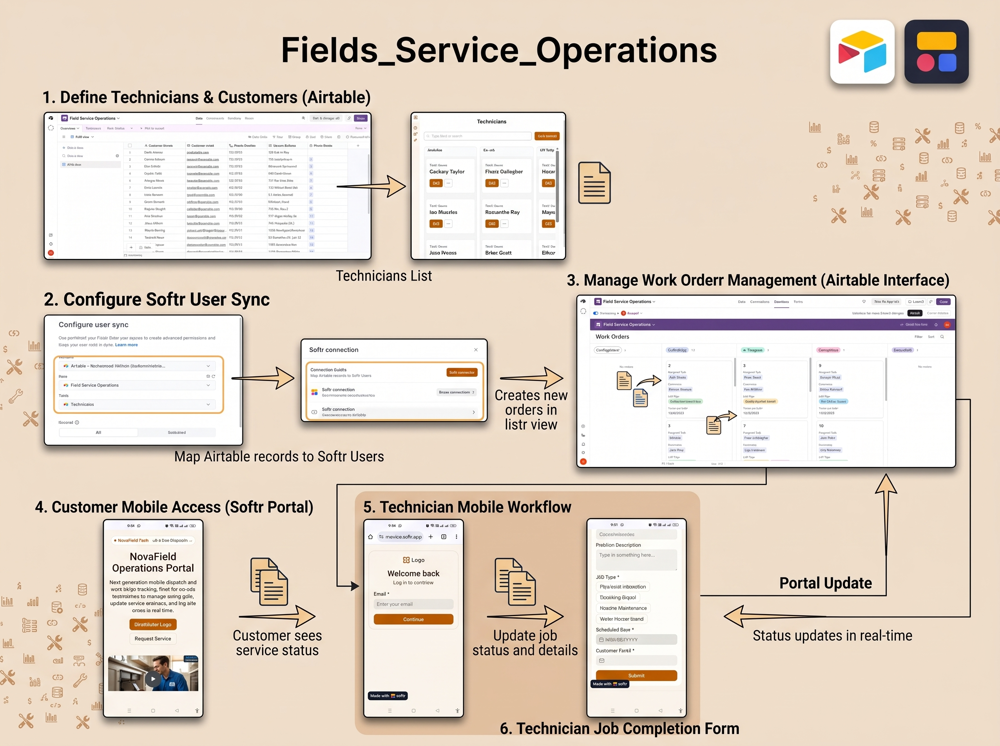
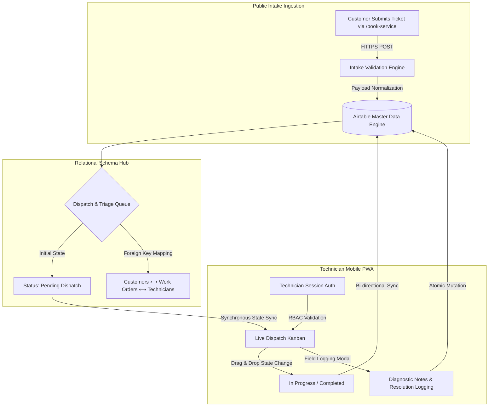

# NovaField Operations Portal & Real-Time Dispatch Engine

---

## 📌 Overview

**NovaField Operations Portal** is an end-to-end field service management and mobile workforce dispatch system for residential and commercial technical operations. It decouples high-velocity public customer intake from authenticated contractor views to eliminate dispatch friction, enforce data segregation, and give field technicians a low-latency mobile execution suite.

---

## 🏗️ Data Ingestion Pipeline

---

## 🗄️ Database Schema

| Collection | Key Fields |
|---|---|
| **Work Orders** | Work Order ID (PK), Job Type (enum), Status (state machine), Technician Notes, Scheduled Date (ISO-8601), Customer Link (FK), Assigned Technician (FK) |
| **Technicians** | Tech ID, Full Name, Email (SSO/magic-link), Assigned Work Orders (inverse FK array), Active Job Count (roll-up) |
| **Customers** | Customer ID, Full Name & Email, Service Address, Service History |

---

## 🚀 Key Capabilities

**Zero-Friction Customer Intake**
- Public route `/book-service` — unauthenticated webform mapped directly to the work order ingestion pipeline
- Strict payload validation on dates, descriptions, and job classification
- Automated post-submission confirmation + dispatch queueing

**Mobile Field Technician Suite (PWA)**
- Interactive Kanban board for state transitions on mobile
- Atomic modals for Status/Notes updates without raw DB access
- Real-time bidirectional data sync

**Enterprise RBAC**
- Public access limited to `/` and `/book-service`; internal consoles fully gated
- Strict read/write role segregation
- Row-level security scoping technicians to their own assigned queues

---

## 🛠️ Stack

| Layer | Technology | Function |
|---|---|---|
| Front-End Portal | Softr Studio | Intake forms, Kanban board, field update modals |
| Database | Airtable Relational Base | Operational datastore, linked records, state enums |
| Auth | Softr Identity & Access Management | User groups, sessions, route-level access rules |
| Sync | Bidirectional REST Sync Engine | Continuous state sync across forms, DB, and technician views |

---

## 📈 Roadmap

- Automated webhook dispatch notifications (SMS/WhatsApp/email on state transitions)
- Dynamic SLA escalation engine for stale `Pending Dispatch` tickets
- Self-service customer status hub via tokenized tracking URLs
